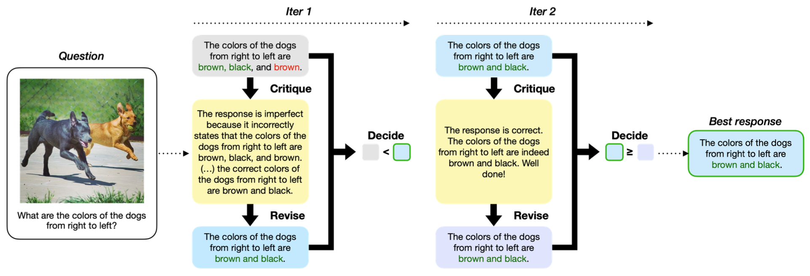
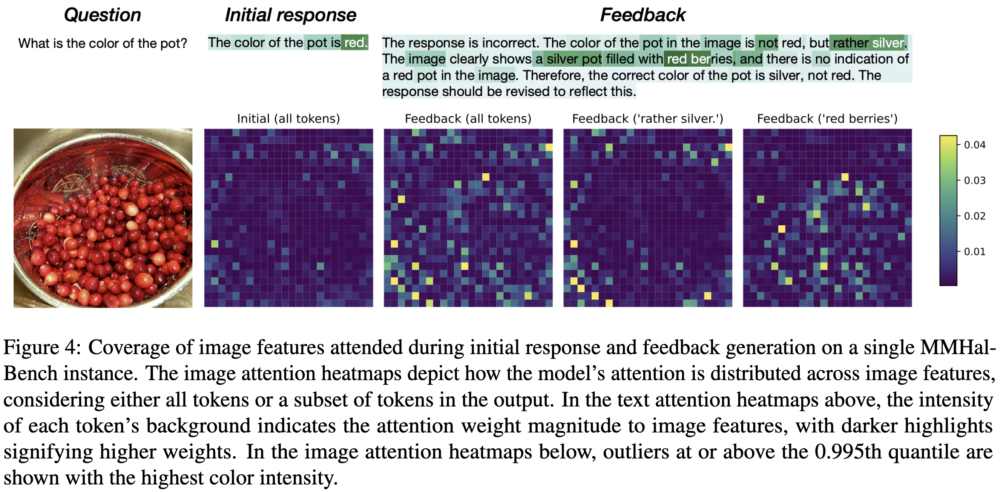

# 🌋 Volcano: Mitigating Multimodal Hallucination through Self-Feedback Guided Revision
\[NAACL 2024\] This is the official github for "Volcano: Mitigating Multimodal Hallucination through Self-Feedback Guided Revision". <br><br>
Volcano employs a single LMM to generate initial responses, feedback, and revisions, as well as decisions to accept revisions. It follows a sequential procedure of an iterative critique-revision-decide loop. <br>
- [Paper](https://aclanthology.org/2024.naacl-long.23/) <br>
- Model weights ([7B](https://huggingface.co/kaist-ai/volcano-7b), [13B](https://huggingface.co/kaist-ai/volcano-13b))
- [Training dataset](https://huggingface.co/datasets/kaist-ai/volcano-train)

## News
\[Apr 5, 2024\] We uploaded our [analysis](#qualitative-analysis) code.  
\[Mar 29, 2024\] We uploaded our [train](#train) and [inference](#inference) code.  
\[Mar 14, 2024\] Our work was accepted to NAACL 2024 main conference! See you in Mexico City 🇲🇽 <br>
\[Nov 14, 2023\] We released the first version of Volcano! Check out the [paper]((https://arxiv.org/abs/2311.07362)), [model](https://huggingface.co/kaist-ai/volcano-13b) and [training dataset](https://huggingface.co/datasets/kaist-ai/volcano-train).

## Overview




> Large multimodal models suffer from multimodal hallucination, where they provide incorrect responses misaligned with the given visual information. Recent works have conjectured that one of the reasons behind multimodal hallucination is due to the vision encoder failing to ground on the image properly. To mitigate this issue, we propose a novel approach that leverages self-feedback as visual cues. Building on this approach, we introduce **Volcano**, a multimodal self-feedback guided revision model. Volcano generates natural language feedback to its initial response based on the provided visual information and utilizes this feedback to self-revise its initial response. Volcano effectively reduces multimodal hallucination and achieves state-of-the-art on [MMHal-Bench](https://huggingface.co/datasets/Shengcao1006/MMHal-Bench), [POPE](https://github.com/RUCAIBox/POPE), and [GAVIE](https://github.com/FuxiaoLiu/LRV-Instruction?tab=readme-ov-file#evaluationgavie). It also improves on general multimodal abilities and outperforms previous models on MM-Vet and MMBench. Through qualitative analysis, we show that Volcano's feedback is properly grounded on the image than the initial response. This indicates that Volcano can provide itself with richer visual information through feedback generation, leading to self-correct hallucinations. We publicly release our model, data, and code.

| Model            | MMHal-Bench Score ↑ | MMHal-Bench Hal rate ↓ | POPE Acc ↑ | POPE F1 ↑ | GAVIE Acc score ↑ | GAVIE Rel score ↑ | GAVIE Avg score ↑ |
|------------------|---------------------|------------|------------|-----------|-------------------|-------------------|-------------------|
| MiniGPT-4 7B     | -                   | -          | 68.4       | 74.5      | 4.14              | 5.81              | 4.98              |
| mPLUG-Owl 7B     | -                   | -          | 51.3       | 67.2      | 4.84              | 6.35              | 5.6               |
| InstructBLIP 7B  | 2.1                 | 0.58       | 71.5       | 80.0      | 5.93              | 7.34              | 6.64              |
| LLaVA-SFT+ 7B    | 1.76                | 0.67       | 81.6       | 82.7      | 5.95              | 8.16              | 7.06              |
| LLaVA-RLHF 7B    | 2.05                | 0.68       | 81.8       | 81.5      | 6.01              | 8.11              | 7.06              |
| LLaVA-SFT+ 13B   | 2.43                | 0.55       | 83.2       | 82.8      | 5.95              | 8.2               | 7.09              |
| LLaVA-RLHF 13B   | 2.53                | 0.57       | 83.1       | 81.9      | 6.46              | 8.22              | 7.34              |
| LLaVA-1.5 7B     | 2.42                | 0.55       | 86.1       | 85.1      | 6.42              | 8.2               | 7.31              |
| LLaVA-1.5 13B    | 2.54                | 0.52       | 86.2       | 85.2      | 6.8               | 8.47              | 7.64              |
| **🌋Volcano 7B**       | 2.6                 | 0.49       | 88.2       | **87.7**  | 6.52              | 8.4               | 7.46              |
| **🌋Volcano 13B**      | **2.64**            | **0.48**   | **88.3**   | **87.7**  | **6.94**          | **8.72**          | **7.83**          |


## Setup
```bash
conda create -n volcano python=3.10 -y
conda activate volcano
pip install --upgrade pip  # enable PEP 660 support
pip install -e .
pip install -e ".[train]"
pip install flash-attn --no-build-isolation
```

## Input and Output Format of Volcano
```
# Critique
Generate the feedback given initial answer referring to question and image.
Question: {Question}
Initial answer: {Initial answer}

# Revise
Adjust the initial response considering the feedback and image.
Question: {Question}
Initial answer: {Initial answer}
Feedback: {Feedback}

# Decide
A. {Initial answer}
B. {Revised answer}
Answer with the option's letter from the given choices directly.
```

Volcano generates an initial response and then repeats the self-revision process a total of 3 times before producing the final answer as the determined response. You can check the [training data](https://huggingface.co/datasets/kaist-ai/volcano-train) for Volcano.

## Train
We use [LLaVA](https://github.com/haotian-liu/LLaVA) codebase in developing Volcano. Therefore, the following training & inference script is tailored to this. If you plan to start from a different VLM codebase, you should adapt the format of the data to suit your custom code.
```
deepspeed --include llava/train/train_mem.py \
    --deepspeed ./scripts/zero2.json \
    --model_name_or_path lmsys/vicuna-13b-v1.5 \
    --version plain \
    --data_path TRAINING_DATA_PATH \
    --vision_tower openai/clip-vit-large-patch14-336 \
    --mm_projector_type mlp2x_gelu \
    --tune_mm_mlp_adapter True \
    --mm_vision_select_layer -2 \
    --mm_use_im_start_end False \
    --mm_use_im_patch_token False \
    --bf16 True \
    --output_dir OUTPUT_DIR \
    --num_train_epochs 1 \
    --per_device_train_batch_size 32 \
    --per_device_eval_batch_size 4 \
    --gradient_accumulation_steps 1 \
    --evaluation_strategy "no" \
    --save_strategy "steps" \
    --save_steps 24000 \
    --save_total_limit 1 \
    --learning_rate 1e-3 \
    --weight_decay 0. \
    --warmup_ratio 0.03 \
    --lr_scheduler_type "cosine" \
    --logging_steps 1 \
    --tf32 True \
    --model_max_length 2048 \
    --gradient_checkpointing True \
    --dataloader_num_workers 4 \
    --lazy_preprocess True \
    --report_to wandb
```
## Inference
We provide the inference code for multimodal hallucination benchmarks. (MMHal-Bench, Pope, GAVIE)
```bash
# MMHal-Bench
python -m llava.eval.volcano_mmhal_bench \
    --model_path kaist-ai/volcano-13b \
    --model_base liuhaotian/llava-v1.5-13b

# Pope
python -m llava.eval.volcano_pope \
    --model-path kaist-ai/volcano-13b \
    --model-base liuhaotian/llava-v1.5-13b \
    --image-folder <IMAGE_FOLDER> \
    --question-file <QUESTION_FILE> \
    --answers-file <ANSWER_FILE>

# GAVIE
python -m llava.eval.volcano_gavie \
    --model-path kaist-ai/volcano-13b \
    --model-base liuhaotian/llava-v1.5-13b \
    --input <INPUT> \
    --output <OUTPUT>
```

## Qualitative analysis
For reproduction of attention heatmaps in our paper, we created a [dedicated folder with step-by-step instructions](./llava/visualize).

## Citation
```
@article{lee2023volcano,
  title={Volcano: mitigating multimodal hallucination through self-feedback guided revision},
  author={Lee, Seongyun and Park, Sue Hyun and Jo, Yongrae and Seo, Minjoon},
  journal={arXiv preprint arXiv:2311.07362},
  year={2023}
}
```