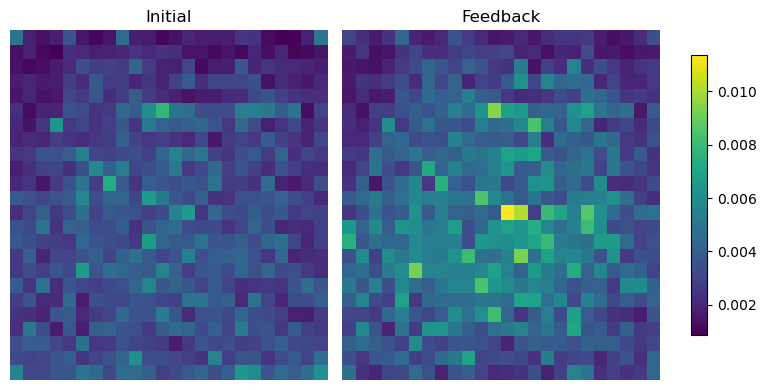
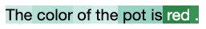
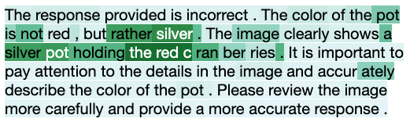
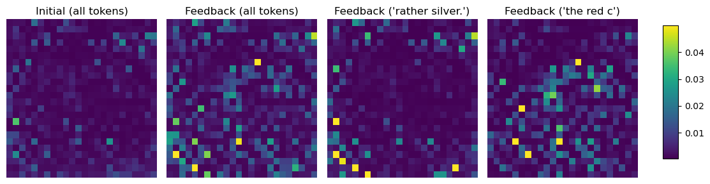

# Reproducing visualization of attention to image features

Following this README, you can reproduce our results in Figure 4 and 5 of our [paper](https://arxiv.org/abs/2311.07362).
In our qualitative analysis, we visualize how *output tokens* attend to *input image features* while generating *initial response* and *feedback*.

## Setting up & Finishing analysis
When preparing input labels, distinguishing image feature labels from non-image feature labels is crucial. To do so, we add the process of constructing an *image attention mask* in the LLaVA architecture, allowing the model to save the image attention mask tensor at the user-specified environment variable `SAVE_IMAGE_ATTENTION_MASK_PATH` and load it for visual analysis. For every new generation, a new tensor is saved and reloaded at the same path. The modified architecture is in [llava_arch_for_image_attention.py](../model/llava_arch_for_image_attention.py).

To enable the new procedure to be perfomed, you must replace the original [llava_arch.py](../model/llava_arch.py) with [llava_arch_for_image_attention.py](../model/llava_arch_for_image_attention.py). We prepared a script that backs up and replaces the architecture file, and then after the visualization process is done, restore the original state. Although such implementation is quite hacky, we didn't integrate the image attention mask implementation in the original code as it could sacrifice inference speed for a one-time analysis.

First, make the following scripts executable:

```
chmod +x backup_and_replace_model_arch.sh restore_original_model_arch.sh
```

**BEFORE starting analysis**, run [backup_and_replace_model_arch.sh](./backup_and_replace_model_arch.sh).
```
bash backup_and_replace_model_arch.sh
```

**AFTER your analysis is done**, run [restore_original.sh](./restore_original_model_arch.sh) to restore the original state.
```
bash restore_original_model_arch.sh
```

### Data
Prepare data in json format, with each json object containing the following keys: `image_id`, `image_src`, `question`, `gold_answer`. We used MMHal-Bench to query Volcano 7B, as seen in [MMHal-bench.json](data/MMHal-bench.json).

```json
 {
    "question_type": "relation",  # optional
    "question_topic": "animal",  # optional
    "image_id": "ebbc5c3c4b35bedd",
    "image_src": "https://c6.staticflickr.com/2/1333/965561501_0b7e9aed90_o.jpg",
    "image_content": [  # optional
        "Plant",
        "Sheep",
        "Tree"
    ],
    "question": "Which sheep is in front of the other sheep?",
    "gold_answer": "The sheep in front of the other sheep is a white sheep."
}
```
> Note (Apr 5, 2024): Some images in MMHal-Bench are not accessible via the path given in `image_src`.

## Average amount of attention to image features (Figure 5)
Here is an example command to visualize average amount of attention to image features during the initial response and feedback generation. Attention weights are averaged across instances in MMHal-Bench where Volcano’s revision enhances the initial response.

```
CUDA_VISIBLE_DEVICES=1 SAVE_IMAGE_ATTENTION_MASK_PATH=llava/visualize/artifacts/image_attention_mask.pt python llava/visualize/run_volcano_with_image_attention.py \
--model-path kaist-ai/volcano-7b \
--input llava/visualize/data/MMHal-bench.json \
--output-dir llava/visualize/figures \
--log llava/visualize/artifacts/example_volcano_7b_MMHal-bench_avg_attention_all.json \
--visualize-avg-attention-all \  # activate visualization mode
```


## Coverage of attended image features for a single instance (Figure 4)
To compare attention weights to image features from all tokens in the output with those from a subset of tokens in the output, follow this three-step process:

### 1. Save necessary information (image attention tensors, token length, etc.) for (an) individual instance(s). 

In this example, we choose instance number 88, which is the same example in our paper.

```
CUDA_VISIBLE_DEVICES=1 SAVE_IMAGE_ATTENTION_MASK_PATH=llava/visualize/artifacts/image_attention_mask.pt python llava/visualize/run_volcano_with_image_attention.py \
--model-path /mnt/sda/checkpoints/suehyun/llava-v1.5-7b-volcano \
--input llava/visualize/data/MMHal-bench.json \
--output-dir llava/visualize/artifacts \
--log llava/visualize/artifacts/example_volcano_7b_MMHal-bench_88_sampled.json \
--instance-idx 88 \  # can input multiple instance indices (comma separated)
--sample \  # choose whether to perform sampling. otherwise, greedy decoding.
--engineered-prompt \  # choose whether to use an engineered prompt to add constraint to the format of output. otherwise, default prompt in volcano.
--output-visualization-tensors \  # activate visualization mode
```

### 2. Create text attention heatmaps to analyze which tokens most intensely attend to image features during generation.

```
python llava/visualize/text_attention_heatmap.py \
--input-dir llava/visualize/artifacts \
--output-dir llava/visualize/figures \
--instance-idx 88
```

The output shows that `rather,silver,.` and `the,red,c` in the feedback text were the tokens most attended to image features during feedback generation.





### 3. Create heatmaps of image feature density from all tokens in the output and from selected tokens in the output.
```
python llava/visualize/image_attention_heatmap.py \
--input-dir llava/visualize/artifacts \
--output-dir llava/visualize/figures \
--vision-encoder-name openai/clip-vit-large-patch14-336 \  # to extract the number of image patches to visualize
--instance-idx 88 \
--feedback-target-tokens rather,silver,. the,red,c  # tokens selected from prior analysis
```

